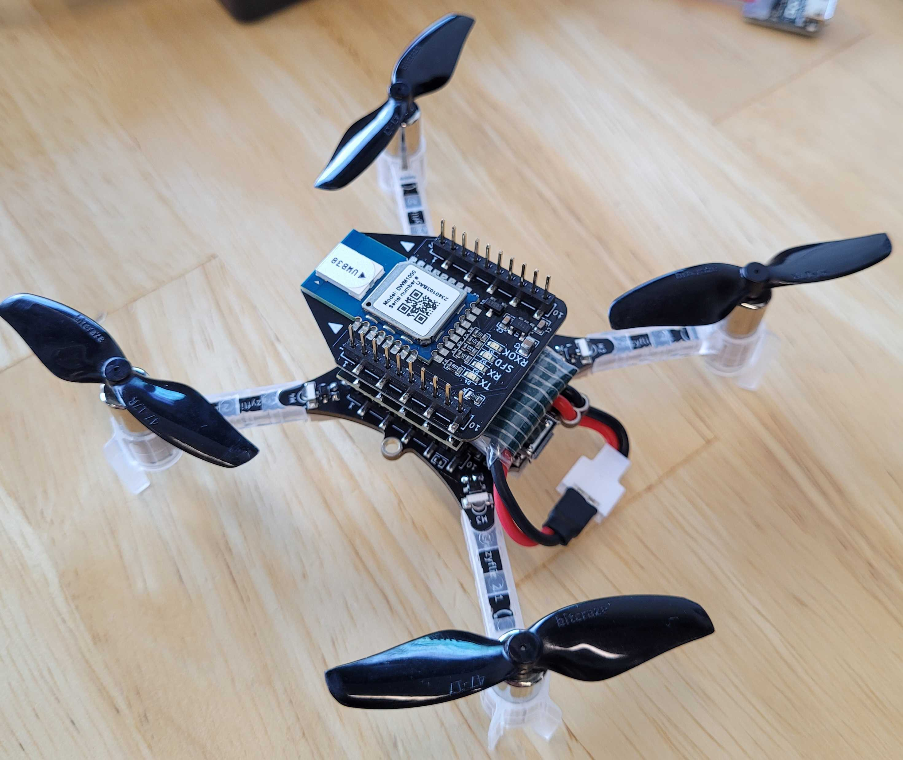

# Crazyflie 2.1+ Testbed Setup

## Step 1: Build the drones

1. Assemble the Crazflie 2.1+ drones by following the [online instructions](https://www.bitcraze.io/documentation/tutorials/getting-started-with-crazyflie-2-x/ 'Get started with the Crazyflie 2.1+'). To accomodate the Loco positioning expansion deck,  **attach the longer header pins** to the base PCB. 

2. Attach the [Loco positioning deck](https://www.bitcraze.io/products/loco-positioning-deck/ 'Loco positioning deck') onto the drone. Ensure the deck is orientated correctly, according to the arrows on the PCB. For further information about mounting, see the [expansion decks tutorial](https://www.bitcraze.io/documentation/tutorials/getting-started-with-expansion-decks/ 'Getting started with expansion decks'). Your drone should now look like this: 

3. The provided [bash script](../scripts/setup_packages.sh) will automatically install the [Crazyflie client](https://github.com/bitcraze/crazyflie-clients-python 'Crazflie Client') and [Python API](https://github.com/bitcraze/crazyflie-lib-python 'Crazyflie Python API').

## Step 2: Setup Radio Communication
1. Follow the [Crazyradio 2.0 setup instructions](https://www.bitcraze.io/documentation/tutorials/getting-started-with-crazyradio-2-0/ 'Crazyradio 2.0'). It is important to flash the firmware first, so it is recognised as a communication device rather than storage.

2. For WSL with Ubuntu 22.04, the USB port must be shared to the VM in order to use it. This can be done through the following [powershell instructions](https://learn.microsoft.com/en-us/windows/wsl/connect-usb 'Connect USB device to WSL').

3. Setup [USB permissions](https://www.bitcraze.io/documentation/repository/crazyflie-lib-python/master/installation/usb_permissions/ 'USB permission for Crazyradio 2.0'). After adding the udev rules, **restart your computer** for the rules to take effect.

4. Check radio communiction by launching crazyflie client from the terminal with ``cfclient``. You should be able to connect to the Crazyflie drone.

5. It is recommended to [update your drone's firmware](https://www.bitcraze.io/documentation/repository/crazyflie-clients-python/master/userguides/userguide_client/#firmware-upgrade 'Update Firmware') through the client at this point.

6. Single drone communication can be tested by running ``python3 /tests/drone_connect_test.py``. 

## Step 3: Setup Loco Positioning Nodes

1. Follow the online [setup instructions](https://www.bitcraze.io/documentation/tutorials/getting-started-with-loco-positioning-system/ 'Loco Positioning Nodes Setup') to setup the [Loco Positioning Nodes](https://www.bitcraze.io/products/loco-positioning-node/ 'Loco Positioning Nodes'). We will make some modifications to parts of these instructions.

2. Build the Loco Positioning Configuration Tool from source: ``git clone https://github.com/bitcraze/lps-tools.git ``. **DO NOT** follow the readme instructions in the repo. Instead, do the following.

3. Install the configuration tool GUI. While in your project's venv, go to the configuration tool's folder: ``cd /lps-tools``. Then, install the required dependendencies with the following: ``pip3 install -e .[pyqt5]``. For the GUI to work, you will likely need to also install pyqt5 through apt-get: ``sudo apt-get install python3-pyqt5``.

4. Set up USB permissions with the following shell instruction: 
    ```
    cat <<EOF | sudo tee /etc/udev/rules.d/99-lps.rules > /dev/null
    SUBSYSTEM=="usb", ATTRS{idVendor}=="0483", ATTRS{idProduct}=="df11", MODE="0664", GROUP="plugdev"
    EOF
    ```
    Also, add the user to the dialout group: ``sudo adduser $USER dialout``. Now, **restart your computer** for the rules to take effect.

5. Download the node [firmware](https://github.com/bitcraze/lps-node-firmware/releases 'Loco Node Firmware') - "lps-node-firmware.dfu". 

6. Update Loco node firmware, following the online [setup instructions](https://www.bitcraze.io/documentation/tutorials/getting-started-with-loco-positioning-system/ 'Loco Positioning Nodes Setup'). Connect a Loco Positioning Node to your PC via micro-usb, **while holding the DFU buttone down**. This will prime the board for a firmware update.  **For WSL**, the USB port must be [shared](https://learn.microsoft.com/en-us/windows/wsl/connect-usb 'Connect USB device to WSL') as before.

7. **Repeat step 6** for all the Loco nodes, to update each node's firmware.

8. Once all nodes' firmwares have been updated, configure and place the anchors as described in the [online instructions](https://www.bitcraze.io/documentation/tutorials/getting-started-with-loco-positioning-system/ 'Loco Positioning Nodes Setup').